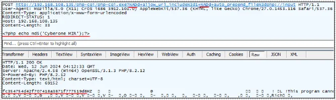

# CVE 분석 보고서 템플릿

## 1. 개요
- **선정한 CVE 번호**: CVE-2024-4577 [관련링크](https://cve.mitre.org/cgi-bin/cvename.cgi?name=CVE-2024-4577)(https://nvd.nist.gov/vuln/detail/cve-2024-4577)
- **간략한 설명**: 해당 취약점은 PHP의 취약버전에서 Best-Fit Mapping을 사용해 인코딩시 유니코드 문자인 소프트 하이픈(”-”,0xAD)을 일반 문자 하이픈(”-”,0x2D)으로 인코딩하면서 발생하개 된다. PHP GCI핸들러는 일반 하이픈(”-”)은 필터링 하지만 소프트 하이픈(”-”)을 필터링하지 않아 Best-Fit Maaping을 통해 변환된 하이픈(”-”)으로 인자 삽입을 시도할 수 있게 되며 발생하게 된다. 주로 중국어 번체 및 간체, 일본어를 사용하는 경우 익스플로잇에 영향을 받을 수 있다.
- **취약점 공개 일자**: 2024년 06월 09일일
- **영향 받는 소프트웨어 및 시스템**: php
| **영향을 받는 버전** | **패치 버전** |
| --- | --- |
| PHP 5, PHP 7, PHP 8.0 | End-of-Life (EOL)
(보안 패치 및 업데이트 지원되지 않음) |
| PHP 8.1.0 ~ PHP 8.1.28 | 8.1.29 |
| PHP 8.2.0 ~ PHP 8.2.19 | 8.2.20 |
| PHP 8.3.0 ~ PHP 8.3.7 | 8.3.8 |

## 2. 취약점 상세 분석

### 2.1 취약점의 기술적 원리
- **취약점 발생 원리 및 공격 메커니즘**:  PHP의 CGI 모드에서는 서버로 전달된 HTTP 요청을 적절히 파싱하고, 이를 처리할 PHP 스크립트로 전달한다. 예를 들어 http://host/cgi.php?abc=g2h 이라는 요청이 서버에 전달되면, php.exe cgi.php abc=g2h 과 같은 명령어가 실행된다
이러한 동작 방식은 command injection 을 일으킬 가능성이 있다. 
 
URL 파라미터와 함꼐 전달된 매개변수에 소프트 하이픈(0XAD)은 일반 하이픈(0X2D)으로 해석되어 PHP 서버에서는 이를 추가로 명령줄 인수로 인식하여 아래와 같이 명령 실행이 된다. 이는 CGI 핸들러는 일반 하이픈(0X2D)는 필터링 하지만, (0XAD)는 필터링 하지 않아, Best-Fit Mapping을 통해 변환된 일반 하이픈(0X2D)으로 Argument Injection을 진행할 수 있게 된다.  
(현재까지는 중국어 번체(코드 페이지 950), 중국어 간체(코드 페이지 936), 일본어(코드 페이지 932) 로케일에서 발생하는 것으로 확인) 
해당 명령이 실행되게 되면, PHP 설정이 변경되며, HTTP Body로 추가 임의의 명령 데이터를 전송하게되면 이를 php 코드로 실행시키게 된다.
<!-- - **관련 코드 또는 구성 요소 분석**: <!-- 마크다운으로 주석 처리 가능 -->

### 2.2 위험성 및 영향 분석
- **CVSS 점수 및 위험성 평가**: Base Score: 9.8 CRITICALVector:  CVSS:3.1/AV:N/AC:L/PR:N/UI:N/S:U/C:H/I:H/A:H
- **실제 발생 가능한 피해 사례**
&emsp; 1. 
    &nbsp; - 
&emsp; 2. 
    &nbsp; - 
&emsp; 3. 
    &nbsp; - 
&emsp; 4. 
    &nbsp; - 
&emsp; 5. 
    &nbsp; - 
&emsp; 6. 
    &nbsp; - 

## 3. 실습 및 공격 재현

### 3.1 실습 환경 구성
- **공격 및 피해 시스템 환경 구축 설명**
| **구분** | **내용** |
| --- | --- |
| 운영체제 | Windows 10 |
| 시스템 로캘 | 중국어 간체 |
| XAMPP 및 PHP 버전 | XAMPP for Windows 8.2.12 (PHP 8.2.12) |
- **사용한 도구 및 소프트웨어 목록**: 
&emsp; 1. burpsuite
### 3.2 공격 단계 및 방법
- **공격 과정 단계별 설명** (스크린샷 또는 코드 예시 포함):
&emsp; 1. 
    &nbsp; - 
&emsp; 2. 
    &nbsp; - 
&emsp; 3. 
    &nbsp; - 
&emsp; 4. 
    &nbsp; - 
&emsp; 5. 
    &nbsp; - 
&emsp; 6. 
    &nbsp; - 
- **성공적인 공격 시나리오 시연**: 

## 4. 대응 방안

### 4.1 패치 및 업데이트
- **해당 CVE에 대응하는 패치 정보**: 
- **업데이트 적용 방법**: 

### 4.2 보안 설정 및 방어 기법
- **시스템 및 네트워크 차원의 보안 설정 권고**: 
- **추가적인 방어 조치 제안**: 

## 5. 결론
- **분석 요약 및 중요성 강조**: 
- **지속적인 모니터링 및 관리 방안 제시**: 

## 참고문헌
- 1. (https://www.cyberone.kr/news-trends-detail?id=113687&page=1)
- 1. 
- 1. 
- 1. 
- 1. 
- 1. 
- 1. 
- 1. 