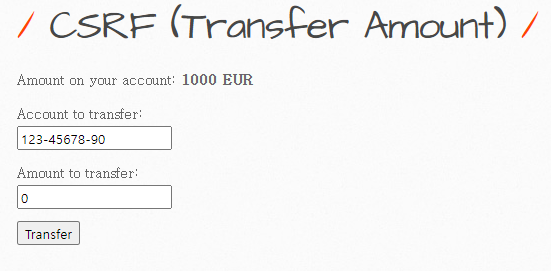

# 취약점 설명
> CSRF 공격은 사용자의 의도와는 무관하게 공격자가 특정 웹 애플리케이션에 요청을 보낼 수 있게 하는 공격이며, 공격자가 사용자의 권한을 이용해 임의의 요청을 서버에 보낼 수 있습니다. 이로 인해 사용자가 의도하지 않은 작업이 수행될 수 있다.


- 해당 유저의 secret 값을 변경하는 로직이 존재

```
secret=test&login=bee&action=change
```

- 해당 요청을 보내게 되면, bee 계정의 secret 값을 변경하는 로직은 POST 형식으로 body부분으로 전달되게 된다.
- 이 또한 이전 패스워드 검사, CAPTCHA, CSRF토큰, Referer 헤더 검증등 어떠한 방어 기법이 적용되어 있지 않다.

```

```

위와 같이 악성 스크립트를 만든 후 XSS 취약점과 연계하여 희생자들의 secret 값을 강제 변경시킬 수 있다.