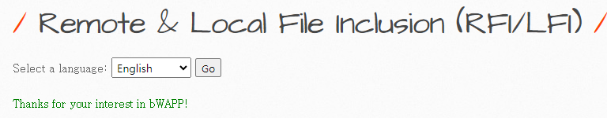
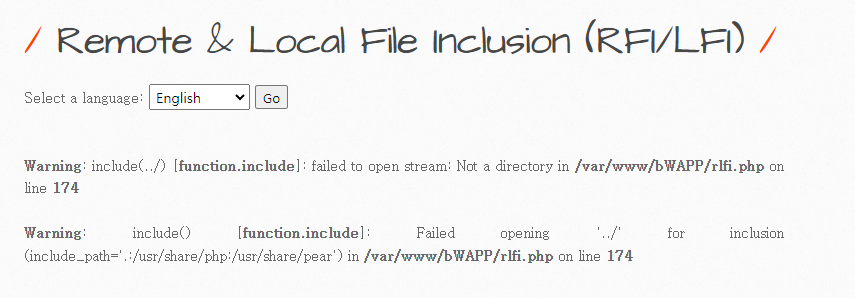
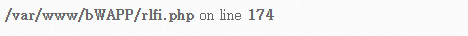
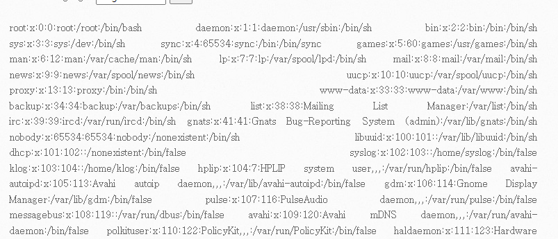

# 취약점 설명
> 해당 취약점은 응용 프로그램에서 File을 불러 올 때 include를 사용하여 코드내에 Built 하거나 동적으로 파일을 포함하는 로직이 구현되어있을경우 일반적으로 나타나며, 다른 Path Traversal 과 같은 타 취약저믈과 연계될 수 있다. 이러한 File Inclusion은 Local File Inclusion(LFI)와 Remote File Inclusion(RFI)로 나뉜다.


- 언어 선택 기능이 존재하고 있다.



```
/bWAPP/rlfi.php?language=lang_en.php&action=go
```

- 특정 언어를 선택하면 해당 언어로 된 페이지를 렌더링 하며, URI를 보게되면 language 파라미터를 통해 특정 php파일을 불러오는 것을 볼 수 있다.
- 이 때 include 방식으로 불러오게 될 경우 경로 이동 문자를 통해 임의의 파일접근이 가능하다.


- 단순 경로이동 문자만 입력시 에러페이지와 함께 include() 함수를 사용한다는 것을 노출시키고 있다.


- 또한 rlfi 디렉터리의 절대경로가 노출되고 있다.

```
/bWAPP/rlfi.php?language=../../../../../etc/passwd&action=go
```


- 경로이동을 통해 최상위 까지 올라간 후 /etc/passwd 파일에 접근이 가능했다.