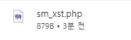

# 취약점 설명
> XSS 공격에 대한 대응 방안으로 HTTPOnly 쿠키가 존재한다. 이는 해당 사이트가 생성한 쿠키가 javascript로 읽히지 않도록 해주는 역할을 한다. 이는 XSS로 인한 세션 탈취를 방지한다.

<br>

> 클라이언트측에서 Request시 사용되는 메서드 중 trace 메서드가 존재하며, 이는 디버깅 목적으로 주로 사용되며, 요청 내용을 그대로 반환해주는 역할을 한다. 이 때 전송값에 쿠키값 또한 존재하므로 xss 취약점으로 악용될 수 있다.


- TRACE 메서드를 사용하여 세션값을 탈취가 이루어질 수 있다고 한다.


- NIKTO를 통해 확인해보면 사용 가능한 메서드중 trace 메서드가 존재하는 것을 확인할 수 있다.

```
TRACE /bWAPP/sm_xst.php HTTP/1.1
```

- 위와 같이 요청 메서드를 TRACE로 변경하여 전송할 경우


- 응답으로 돌아오는 값들이 파일로서 다운받아진다.
- 해당 내용 안에는 클라이언트측에거 요청한 요청값들이 고스란히 반환되며, 이 때 세션값 또한 기록되어 있다.


 게시물과 같은 Stored XSS에 취약한 환경이며 TRACE메서드를 허용할 경우 AJAX형태로 XST 공격이 이루어진다.