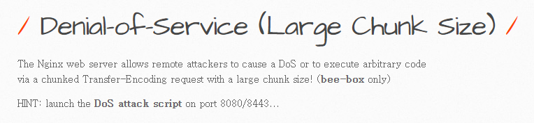

> 취약점 설명
- DoS는 서비스 거부 공격으로, 대상 시스템에 대한 가용성을 무너뜨리는 공격이다. 대표적으로 대역폭 공격, 리소스 고갈, 프로토콜 공격, 공격자 자원 고갈등이 존재한다.

- 8080/8443 포트로 Nginx 웹 서버가 동작중이며, 해당 웹 서버는 chunked Transfer-Encoding을 통한 DoS 공격에 취약하다고 한다.

***
HTTP Chunked는 request body의 크기를 가변적으로 정할 수 있는 기능이다.
***