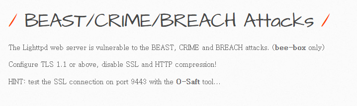

# 취약점 설명
> POODLE 취약점은 SSL3.0에서 발견된 보안 취약점으로, 중간자 공격을 통해 암호화된 통신을 해독할 수 있도록 하는 공격이다.


- 해당 웹 서버는 POODLE 취약점이 존재 한다고 한다.

```
nmap -p443 --script ssl-poodle -sV 192.168.146.133
```

- NMAP을 통한 POODLE 취약점 스캔 시도


- 취약점이 도출 된 걸 볼 수 있다.
- 이를 해결하기 위해 SSL 3.0 버전을 사용해서는 안된다.