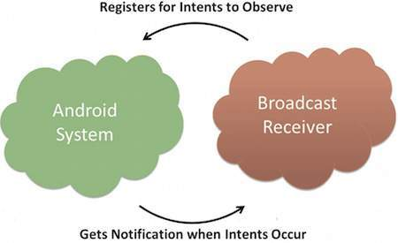

# Flawed Broadcast Receivers

## Broadcast Receivers란 무엇인가?

<div class="notice--primary" markdown="1">
애플리케이션의 4대 구성 단위중 하나로서 안드로이드 앱에서 발생하는 시스템 브로드캐스트 메시지를 수신하여 처리하는 구성 요소이다. 브로드캐스트 리시버는 안드로이드 앱의 다른 구성 요소들이나 외부 시스템에서 발생한 이벤트에 반응하여 특정 작업을 수행할 수 있도록 해준다.

> 여기서 브로드캐스트 메시지란 시스템에서 발생하는 이벤트를 알리기 위한 메시지이며, 이러한 메시지를 이벤트 혹인 인텐트(intent)라고도 부른다. 예를 들어 애플리케이션은 브로드캐스트를 시작하여 다른 애플리케이션에 일부 데이터가 디바이스에 다운로드 되어 사용할 수 있음을 알릴 수 있으며, 브로드캐스트 리시버는 이 통신을 가로채 적절한 조치를 취한다.`

```
브로드캐스트 리시버는 안드로이드의 매니페스트 파일(AndroidManifest.xml 의 <receiver></receiver>항목)에 등록되어야 하며, 등록된 브로드캐스트 이벤트가 발생했을 경우 시스템에 의해 호출된다.
``` 

브로드 캐스트 리시버가 정상적으로 작동하려면 우선 브로드캐스트 리시버를 생성 및 등록이 이루어져야한다.
<br>
브로드캐스트 리시버는 BroadcastReceiver 클래스의 서브클래스로 구현되며, 각 메시지를 intent 객체 파라미터로 수신하는 onReceiver() 메서드를 재정의 한다.



[Example Code]

```java
public class MyReceiver extends BroadcastReceiver {
   @Override
   public void onReceive(Context context, Intent intent) {
      Toast.makeText(context, "Intent Detected.", Toast.LENGTH_LONG).show();
   }
}
```

</div>

어플리케이션에서 선언한 액션을 호출하면 리시버는 해당 액션을 인지하여 작업을 수행하게 하고, 이러한 작업은 브래드캐스트 리시버를 상속 받은 메서드에서 처리하게 된다.
<br>
브로드캐스트 리시버 호출 시 발생하는 브로드캐스트가 정상이면 각각의 시스템 이벤트와 다른 어플리케이션에서 발생하는 경우가 있으며, 비정상일 경우 악의적인 어플리케이션에서 발생하거나, 악의적인 사용자에 의해 임의대로 생성할 수 있게 된다.

## Flewed Broadcas Receivers
💡 **<u><span style="background-color: yellow; ">해당 취약점 실습은 "InsecureBank2"라는 모바일 뱅킹서비스 어플리케이션으로 진행합니다.</span></u>** 
{: .notice--primary}

### 취약점 분석


# Referance
- https://www.tutorialspoint.com/android/android_broadcast_receivers.htm