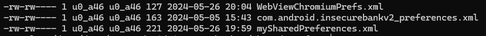

# Local Encryption issues이란?
> Local Encryption issues의 경우 데이터를 로컬 저장소(예를 들어, 하드 드라이브, SSD, 기기 내 저장소 등)에 암호화할 때 발생하는 문제이다.
어플리케이션 환경설정 정보, 외부 API 연동 및 인증 토큰 등과 같은 각각의 정보들을 로컬 스토리지에 저장하게 된다. 이 경우 보안을 고려하지 않게되면, 평문 형태의 파일로 저장하게되며, 악의적인 사용자에 의해 해당 정보들을 탈취당할 수 있게 된다.
<br>
안드로이드 플렛폼에서 저장소는 Internal Sotrage와 External Sorage가 존재한다.

**<u style="color:red">1. Internal Sotrage</u>**
<br>
각 어플리케이션은 /data/data/\<package-name\> 과 같은 경로에 생성되며, 다른 어플리케이션에서는 접근할 수 없다.
- Shared Prefrences 
    - 안드로이드에서 중요한 앱 설정 및 관련 정보가 포함되며, Key-Value 쌍으로 앱의 환경 설정을 저장하는데 사용되는 XML 파일이다.
    - 어플리케이션 내에서 액티비티가 호출되면 key.xml 파일에 제공된 데이터가 저장되며, 사용자 이름, 패스워드와 같은 정보들은 /data/data/<package-name>/shared_prefs/key.xml에 저장된다
    - MODE_WORLD_READBLE을 사용하면 모든 어플리케이션이 key.xml에 접근이가능하다.
    > MODE_WORLD_READABLE 및 MODE_WORLD_WRITEABLE은 Android 4.2(API Level 17)부터 더 이상 사용되지 않아, android:targetSdkVersion값이 17보다 작은 어필레키여션은 영향을 받음
- SQLite Databases
    - 컨텐츠 및 사용자들에 대한 목록이 저장되는 데이v터베이스로 모바일 환경에서 일반적으로 사용되는 경량 파일 기반의 데이터베이스이다.
    - 안드로이드 SDK는 SQLite데이터베이스를 기본적으로 지원한다.
    - 데이터베이스를 관리하는 데 사용되는 기본 페이지는 android.database.slqite이며, 두 가지 종류인 Unecrypted 및 Encrypted로 나눌 수 있다.
    - 액티비티 호출 시 제공된 데이터로 /data/data/\<package-name\>/databvases/privateNoSoSecure에 저장된다.

**<u style="color:red">2. External Storage</u>**
<br>
이동식 저장매체 또는 내부 저장소로 볼 수 있으며, 모든 어플리케이션이 접근가능하기에 민감 데이터가 저장되서는 안된다. 액티비티 호출 시 파일이 저장되며, 일반텍스트 파일에 저장되며, 어플리케이션 제거시 어플리케이션 폴더 외부에 저장된 파일은 삭제되지 않는다.
<hr>
<div class="notice">
  <h4 style="color:red">/data/data 겨올는 리눅스계열의 /home 디렉터리와 유사한 성격을 가진다고 생각하면 된다.</h4>
  <hr>
  Internal Storage의 경우 cache, databases, lib, shared_prefs, db파일등이 존재하며, mySharedPerferences.xml에 계정 정보가 저장되어 있는 경우 adb pull \<xml파일 풀경로\>를 통해 가져와 유저이름 부분을 각 인코딩 및 암호화에 맞게 다른 유저(본인)로 수정하여 다시 push하여 적용이 되는지, 즉 무료 사용자가 유료 컨텐츠 접근이 가능하지에 취약점 점검이 가능하다.
  <hr>
  External Storage의 경우 /sdcard, /mnt/sdcard와 같은 경로에 사진, 파일 다운로드, 동영상, 공인인증서(mpkai) 등이 저장된다.
</div>

## 취약점 분석

ADB를 통해 해당 어플리케이션의 패키지 경로로 이동 후 Shared Prefrences 위치로 이동한다.

```
/data/data/com.android.insecurebankv2/shared_prefs
```


- 해당 경로를 확인하면 3개의 파일이 존재하는 걸 볼 수 있다.

1. "WebViewChromiumPrefs.xml"


2. "com.android.insecurebankv2_preferences.xml"


3. "mySharedPreferences.xml"


<hr>
com.android.insecurebankv2_preferences.xml 파일에는 해당 서버가 사용중인 서버IP와 포트가 저장되어 있으며,
mySharedPerferences.xml 파일을 보게되면, 특정 계정정보가 암호화 되어 있는 걸 알 수 있다.
<br><br>

자세히 보게되면 해당 방식은 base64 인코딩 방식으로 매우 취약하게 설정되어 있는 듯 하며, 실제로 이를 디코딩 하게되면, **<u style="color:red;">ID: jack으로 디코딩 되었으며, PW의 경우 디코딩 되지 않는 것으로 보아, 다른 암호화 방식을 사용한 듯 하다.</u>**

<br><br>
해당 어플리케이션의 소스코드중 Dologin.java 파일을 확인해보면

```java
private void saveCreds(String username, String password) throws UnsupportedEncodingException, InvalidKeyException, NoSuchAlgorithmException, NoSuchPaddingException, InvalidAlgorithmParameterException, IllegalBlockSizeException, BadPaddingException {
			// TODO Auto-generated method stub
			SharedPreferences mySharedPreferences;
			mySharedPreferences = getSharedPreferences(MYPREFS, Activity.MODE_PRIVATE);
			SharedPreferences.Editor editor = mySharedPreferences.edit();
			rememberme_username = username;
			rememberme_password = password;
			String base64Username = new String(Base64.encodeToString(rememberme_username.getBytes(), 4));
			CryptoClass crypt = new CryptoClass();;
			superSecurePassword = crypt.aesEncryptedString(rememberme_password);
			editor.putString("EncryptedUsername", base64Username);
			editor.putString("superSecurePassword", superSecurePassword);
			editor.commit();
		}
```

위 코드를 볼 수 있다. 해당 코드를 보면 username의 경우 base64인코딩 방식을 통해 인코딩 하고, password의 경우 CryptoClass()를 통해 ase알고리즘을 사용한 암호화를 한다는 것을 알 수 있다. 또한 해당 정보들은 클래스 파일 생성을 통해 mYshaerdPreferences에 저장된다.
<br><br>
또한 

```java
public class CryptoClass {

	//	The super secret key used by the encryption function
	String key = "This is the super secret key 123";
```

또 다른 소스코드인 CryptoClass.java 소스코드를 보게되면 password를 AES 방식으로 암호화 할 때 사용하는 키 값을 하드코딩 된 채로 노출되고 있다. AES의 경우 대칭키 암호화 알고리즘이므로 Key 값이 노출될 경우 이를 통해 복호화가 가능하다.


