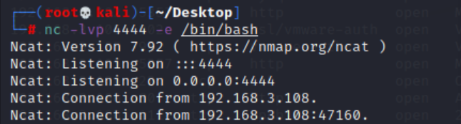
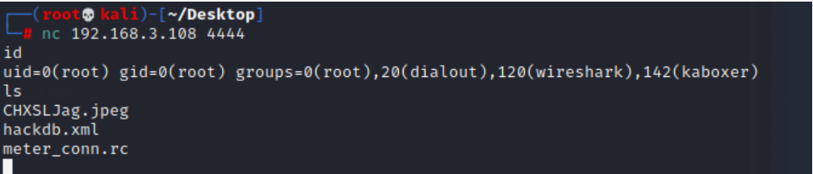

> 보통 쉘을 획득할떄는 두 가지 방법을 사용한다.대표적으로 바인드 쉘과, 리버스 쉘이라는것을 사용한다.

# 1. 바인드 쉘[Bind Shell]

> 바인드 쉘의 경우, 서버에서 포트가 열려있고 클라이언트에서 접속하여 쉘을 얻는 방식이다.일반적으로 가장 많이 사용되는 방식이며, 아래와 같이 사용된다.

 

nc(netcat)을 통해 서버를 열어준다 
-l : listen모드로 port를 열어준다. 
-v : verbosity를 증가시키며, 더 많은 정보를 얻을 수 있다. 
-p : local port를 지정해준다. 
-e :  명령어가 실행된 후 추가적으로 실행시킬 명령어 
 즉 4444번 포트를 사용하여 서버를 열며, 서버에 접속하면 /bin/bash명령어를 실행시켜준다. 

 
 
 위 사진과 같이 접속하여 쉘을 획득 할 수 있다. 이것이 바인드 쉘이다. 

 # 2. 리버스 쉘[Reverse Shell]
 
 리버스쉘은 클라이언트가 서버를 열고, 서버에서 클라이언트쪽으로 접속하는 형태 이다.  
리버스 쉘을 사용하는 이유는 방화벽 때문이다. 주로 방화벽은 외부에서 내부로 들어오는 것은 
막지만 내부에서 외부로 나가는 것은 막지 않기 때문이다. 
이용법은 위의 단계에서 반대로라고 생각하면 편하다 클라이언트에서 nc를 통해 서버를 열고 
서버에 침투해서 해당 클라이언트로 접속하면 된다.