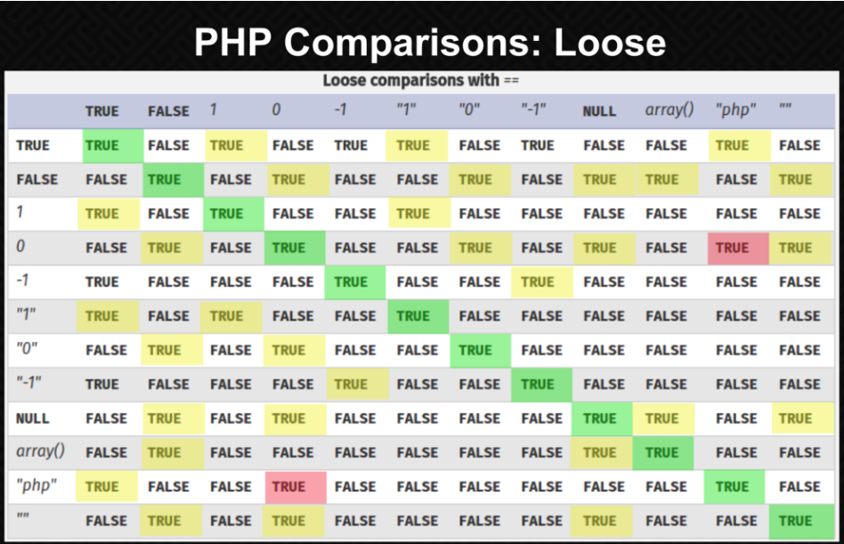

# strcmp() 함수란?
> 두 문자를 비교하여, 그 결과를 반환해주는 함수이다.  string1이 string2보다 작으면 음수를 반환하고 string1이 string2와 같으면 0을 반환한다. string1이 string2보다 크면 양수를 반환하게된다.

```php
int strcmp(string1, string2);
```

- Returns -1 if string1 < string2
- Returns 0 if string1 === string2
- Returns +1 if string1 > string2
위와 같은 동작을 수행한다.

# 어디서 취약점이 발생하는가?

```php
if (strcmp($_POST['passwd']), '$checkpass') == 0){
	login()
}  
```

위와 같이 login 함수를 호출하기 전에 if 조건이 수행된다고 가정해보자.<br>
POST 방식으로 입력 받은 패스워드를 기존에 저장되어 있던 패스워드와 비교하고 비교한 결과를 strcmp() 함수의 반환 값 0 즉 동일한 경우에 login() 함수가 호출되는 큰 문제가 없어 보이는 코드이다.<br>

이 때 if문을 자세히보면==이라는 비교문자를 사용하고 있다. 이는 Type juggling 라는 취약점과도 동일하며, 잘못된 동작으로도 이어질 수 있다.<br>
우선 악의적인 사용자가 $_POST[’passwd’]를 제어할 수 있게되면, 해당 검증 코드를 우회할 수 있다.
<br>
 $_POST[’passwd’]를 서버측에 전송하게되면 passwd=test 와 같이 전달되지만, passwd[]=''와 같이 Array(배열) 형식으로 전송하게 되면 strcmp() 함수는 Array(배열) 과 string(문자열)을 비교하며 이에 따른 반환값으로 NULL을 반환하게 된다.<br>

PHP의 ==을 통한 비교 결과를 확인해보면 null == 0 은 true가 된다.<br>


이를 통해 if문을 통과하게되며, 검증을 우회할 수 있다.
<br>
이를 보안하기 위해서는 정확한 비교를 위해 ===을 사용해야 한다.


# Referance
- https://www.php.net/manual/en/types.comparisons.php
- https://cybernetgen.com/auth-bypass-with-php-type-juggling/