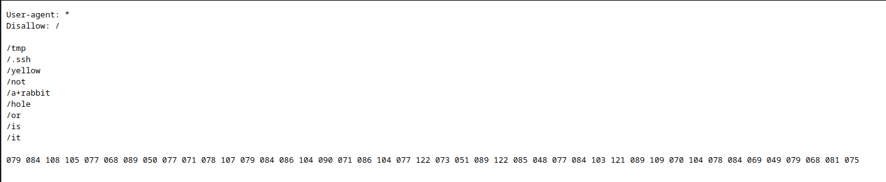

해당 문제는 [https://tryhackme.com/r/room/dogcat](https://tryhackme.com/r/room/dogcat) 에서 확인할 수 있습니다.

# Dogcat 시스템 모의 침투
## 수행 내용
1. 정보 수집
2. 
3. 
4. 
5.  
## 정보수집
### Nmap 스캔 - 사용중인 포트 및 배너, 기본 정보 수집

```
nmap -p- --max-retries 1 -Pn -n --open --min-rate 5000 -T4 -sV -sC -A -oA ./dogcat {target_ip}
```

```
Starting Nmap 7.93 ( https://nmap.org ) at 2024-04-03 08:04 EDT
Nmap scan report for 10.10.19.95
Host is up (0.41s latency).
Not shown: 35315 filtered tcp ports (no-response), 30218 closed tcp ports (conn-refused)
Some closed ports may be reported as filtered due to --defeat-rst-ratelimit
PORT   STATE SERVICE VERSION
22/tcp open  ssh     OpenSSH 7.6p1 Ubuntu 4ubuntu0.3 (Ubuntu Linux; protocol 2.0)
| ssh-hostkey: 
|   2048 2431192ab1971a044e2c36ac840a7587 (RSA)
|   256 213d461893aaf9e7c9b54c0f160b71e1 (ECDSA)
|_  256 c1fb7d732b574a8bdcd76f49bb3bd020 (ED25519)
80/tcp open  http    Apache httpd 2.4.38 ((Debian))
|_http-server-header: Apache/2.4.38 (Debian)
|_http-title: dogcat
Service Info: OS: Linux; CPE: cpe:/o:linux:linux_kernel

Service detection performed. Please report any incorrect results at https://nmap.org/submit/ .
Nmap done: 1 IP address (1 host up) scanned in 70.89 seconds
```

- 22(SSH), 80(HTTP) 포트로 서비스 동작중 확인
- Web Service는 아파치 2.4.38 버전 사용인 걸로 확인
- OpenSSH 7.6p1 으로 확인


- 웹 서비스 동작중이므로, 웹 사이트 접속 시도
- a dog, a cat 버튼이 존재하며, 해당 버튼을 누르게되면 각 동물 사진이 출력됨.
- 해당 페이지 소스에서는 하드코딩된 정보와 같은 유의미한 정보는 없음