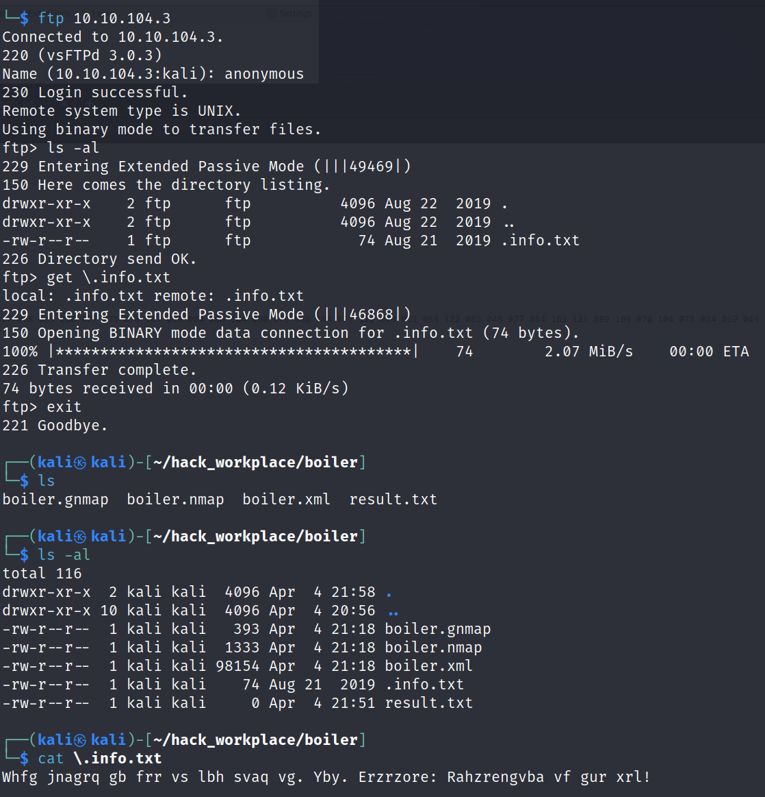
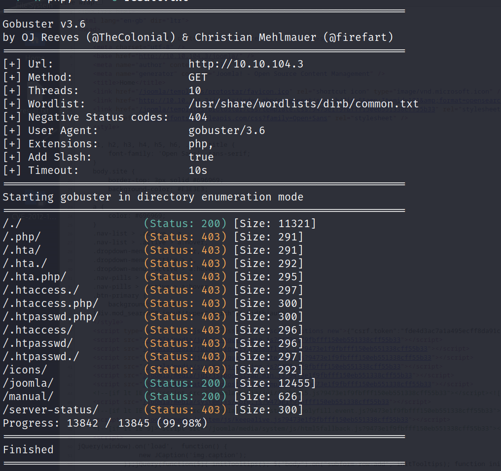

해당 문제는 [https://tryhackme.com/r/room/boilerctf2](https://tryhackme.com/r/room/boilerctf2) 에서 확인할 수 있습니다.

***

# Boiler CTF 시스템 모의 침투
## 수행 내용
1. 정보 수집
2. 
3. 
4. 
5. 
## 정보수집
### Nmap 스캔 - 사용중인 포트 및 배너, 기본 정보 수집

```
nmap -p- --max-retries 1 -n --open --min-rate 5000 -T4 -sV -sC -A -oA ./boiler {target_ip}
```

```
Starting Nmap 7.93 ( https://nmap.org ) at 2024-04-04 21:17 EDT
Nmap scan report for 10.10.104.3
Host is up (0.42s latency).
Not shown: 59811 closed tcp ports (conn-refused), 5720 filtered tcp ports (no-response)
Some closed ports may be reported as filtered due to --defeat-rst-ratelimit
PORT      STATE SERVICE
21/tcp    open  ftp
| ftp-syst: 
|   STAT: 
| FTP server status:
|      Connected to ::ffff:10.4.47.45
|      Logged in as ftp
|      TYPE: ASCII
|      No session bandwidth limit
|      Session timeout in seconds is 300
|      Control connection is plain text
|      Data connections will be plain text
|      At session startup, client count was 3
|      vsFTPd 3.0.3 - secure, fast, stable
|_End of status
|_ftp-anon: Anonymous FTP login allowed (FTP code 230)
80/tcp    open  http
| http-robots.txt: 1 disallowed entry 
|_/
|_http-title: Apache2 Ubuntu Default Page: It works
10000/tcp open  snet-sensor-mgmt
|_ssl-date: TLS randomness does not represent time
| ssl-cert: Subject: commonName=*/organizationName=Webmin Webserver on Vulnerable
| Not valid before: 2019-08-22T09:22:57
|_Not valid after:  2024-08-20T09:22:57
55007/tcp open  unknown

Nmap done: 1 IP address (1 host up) scanned in 49.61 seconds

```

- 21번 포트로 FTP 서비스 동작중 (Anonymous 사용자 접근 가능)
- 80번 포트로 HTTP 웹 서비스 동작중
- 10000번 포트로 HTTPS 웹 서비스 동작중
- 55007 포트 서비스 동작중


- 웹 서비스 접근 후 robots.txt 열람 가능
- 최상위 경로에 존재하는 경로 및 파일명 확인이 가능함.

```
┌──(kali㉿kali)-[~/hack_workplace/boiler]
└─$ nmap -p 10000, 55007 -sV -sC -A 10.10.104.3                                         
Starting Nmap 7.93 ( https://nmap.org ) at 2024-04-04 22:00 EDT
Stats: 0:00:12 elapsed; 1 hosts completed (1 up), 1 undergoing Service Scan
Service scan Timing: About 100.00% done; ETC: 22:01 (0:00:00 remaining)
Stats: 0:00:13 elapsed; 1 hosts completed (1 up), 1 undergoing Script Scan
NSE Timing: About 80.14% done; ETC: 22:01 (0:00:00 remaining)
Stats: 0:00:13 elapsed; 1 hosts completed (1 up), 1 undergoing Script Scan
NSE Timing: About 80.82% done; ETC: 22:01 (0:00:00 remaining)
Nmap scan report for 10.10.104.3
Host is up (0.53s latency).

PORT      STATE SERVICE VERSION
10000/tcp open  http    MiniServ 1.930 (Webmin httpd)
|_http-server-header: MiniServ/1.930
|_http-title: Site doesn't have a title (text/html; Charset=iso-8859-1).

Service detection performed. Please report any incorrect results at https://nmap.org/submit/ .
Nmap done: 2 IP addresses (1 host up) scanned in 46.09 seconds
                                                                                                                                                                    
┌──(kali㉿kali)-[~/hack_workplace/boiler]
└─$ nmap -p 55007 -sV -sC -A 10.10.104.3 
Starting Nmap 7.93 ( https://nmap.org ) at 2024-04-04 22:02 EDT
Nmap scan report for 10.10.104.3
Host is up (0.48s latency).

PORT      STATE SERVICE VERSION
55007/tcp open  ssh     OpenSSH 7.2p2 Ubuntu 4ubuntu2.8 (Ubuntu Linux; protocol 2.0)
| ssh-hostkey: 
|   2048 e3abe1392d95eb135516d6ce8df911e5 (RSA)
|   256 aedef2bbb78a00702074567625c0df38 (ECDSA)
|_  256 252583f2a7758aa046b2127004685ccb (ED25519)
Service Info: OS: Linux; CPE: cpe:/o:linux:linux_kernel

Service detection performed. Please report any incorrect results at https://nmap.org/submit/ .
Nmap done: 1 IP address (1 host up) scanned in 15.28 seconds
```

- 추가적인 스캔 결과 10000 포트에 webmin 서비스 동작 중 확인
- 55007 포트에 ssh 서비스 동작중을 확인


- ftp 서비스에 Anonymous 사용자로 접근 가능하며
- 숨김파일인 .info.txt 파일 존재
- 해당 파일을 가져와 열어보면 알 수 없는 문자열로 되어있음
- 카이사르 암호로 추측하여 이를 복화하기 시작

```
Just wanted to see if you find it; Lol; RememberG Enumeration is the key
```

- 14번의 문자열을 옮긴 후 읽을 수 있는 문장이 춮력됨
- RememberG 열거가 핵심이라고 한다.


- 웹 서비스에 대한 디렉터리 부르트포싱을 시도했다.
- 그 결과 2개의 경로가 발견되었으며
- joomla 경로가 존재했으며, joolma CMS로 만들어진 웹 페이지가 존재했다. 즉 해당 페이지에서 사용중인 CMS는 joolma이다.

